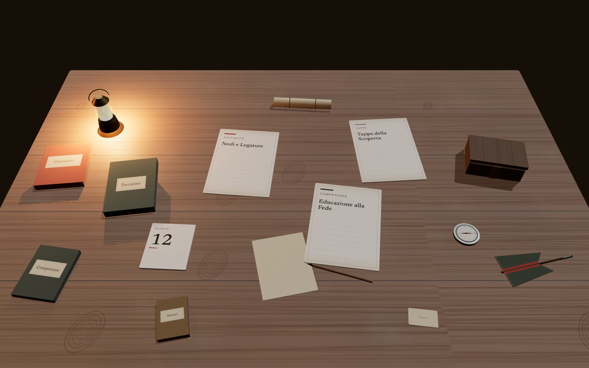

# ORMA

> Il tavolo è l'interfaccia. Le carte sono il contenuto. Il Reparto è il contesto. L'account è la persona.

ORMA è una web app personale per Esploratori e Guide AGESCI, costruita attorno al
percorso scout di chi la usa: Specialità, Competenze e Tappe.

Dopo il login non c'è una dashboard. C'è **il proprio tavolo**, visto dall'alto,
illuminato da una lampada a gas: le carte del percorso in corso, la cassetta del
Reparto, l'album dei distintivi, il calendario delle uscite. Ogni funzionalità
dell'app è un oggetto che si prende in mano.



---

## Il tavolo

Non esiste una pagina "Reparto" o una pagina "Impostazioni": esiste una cassetta
di legno e una tessera. Aprire un oggetto lo porta in primo piano, la camera si
avvicina, il tavolo resta visibile ma sfocato, e il contenuto compare su un
foglio di carta. Chiudendo, si torna al tavolo.

| Oggetto                                | Cosa apre                                                           |
| -------------------------------------- | ------------------------------------------------------------------- |
| Carte di Specialità, Competenza, Tappa | il percorso in corso: contenuto ufficiale, progresso, note, Maestro |
| Cassetta di Reparto                    | i membri del Reparto e, per i Capi, le richieste di adesione        |
| Guidone di Squadriglia                 | le Squadriglie e l'assegnazione dei membri                          |
| Calendario                             | uscite, campi e riunioni del Reparto                                |
| Album dei distintivi                   | il catalogo delle Specialità                                        |
| Quaderno                               | il catalogo delle Competenze                                        |
| Mappa arrotolata                       | le Tappe                                                            |
| Rubrica                                | i Maestri del proprio percorso e la ricerca globale                 |
| Tessera                                | profilo, dati dell'account, uscita                                  |
| Busta                                  | la richiesta di adesione a un Reparto                               |

Cosa c'è sul tavolo dipende dalla situazione reale di chi guarda: chi non
appartiene ancora a un Reparto trova la busta, e non trova cassetta, guidone e
calendario. Matita, bussola e lampada a gas non si aprono: servono all'atmosfera
— la lampada è anche la sorgente di luce calda della scena, così la luce ha una
causa visibile.

Gli indirizzi diretti (`/reparto`, `/impostazioni`, `/specialita`, …) continuano
a funzionare: aprono il tavolo con quell'oggetto già in mano.

---

## Stack

| Livello             | Scelta                                                                            | Decisione                       |
| ------------------- | --------------------------------------------------------------------------------- | ------------------------------- |
| Frontend            | Next.js 16 (App Router), TypeScript strict                                        | [DEC-001](.claude/DECISIONS.md) |
| Scena 3D            | React Three Fiber su Three.js                                                     | [DEC-003](.claude/DECISIONS.md) |
| Resa                | PBR in tempo reale, ambiente procedurale, ombre morbide — **niente path tracing** | [DEC-020](.claude/DECISIONS.md) |
| Stato di scena      | Zustand (solo presentazione: oggetto a fuoco)                                     | [DEC-004](.claude/DECISIONS.md) |
| Transizioni DOM     | `motion`                                                                          | [DEC-012](.claude/DECISIONS.md) |
| Styling             | Tailwind per la UI, materiali Three.js per la scena                               | [DEC-009](.claude/DECISIONS.md) |
| Backend             | Supabase: Postgres, Auth, Storage, Row Level Security                             | [DEC-002](.claude/DECISIONS.md) |
| Email transazionali | Resend (consenso genitoriale)                                                     | [DEC-011](.claude/DECISIONS.md) |
| Deploy              | Vercel + Supabase Cloud                                                           | [DEC-007](.claude/DECISIONS.md) |

La scena 3D è riservata a desktop e tablet con WebGL; mobile, assenza di WebGL e
`prefers-reduced-motion` usano una composizione 2D dedicata che raggiunge gli
stessi contenuti ([DEC-013](.claude/DECISIONS.md)).

---

## Avvio

```bash
npm install
cp .env.local.example .env.local   # poi compila le chiavi Supabase
npm run dev
```

L'app richiede un progetto Supabase con lo schema in `supabase/migrations/`
applicato. Senza quelle chiavi il server di sviluppo parte, ma le rotte che
leggono dati non possono funzionare: l'unica pagina utilizzabile è la sandbox
della scena qui sotto, che non tocca il database.

**Sandbox della scena** — per lavorare su resa e interazione senza autenticarsi:

```
http://localhost:3000/tavolo-dev          # dati dimostrativi, 404 in produzione
http://localhost:3000/tavolo-dev?q=base   # forza il livello di qualità
http://localhost:3000/tavolo-dev?perf=1   # render loop continuo, per misurare
```

| Comando            | Cosa fa                                           |
| ------------------ | ------------------------------------------------- |
| `npm run dev`      | server di sviluppo                                |
| `npm run build`    | build di produzione                               |
| `npm run lint`     | ESLint                                            |
| `npm run format`   | Prettier (esclude `docs/`, `.claude/`, `IDEA.md`) |
| `npm test`         | unit test (Vitest + Testing Library)              |
| `npm run test:e2e` | end-to-end (Playwright, Chromium)                 |

Gli E2E autenticati richiedono `E2E_EMAIL` e `E2E_PASSWORD` di un account di
prova: senza, si saltano da soli, così la suite resta eseguibile da chiunque
senza segreti nel repository. Serve `npx playwright install chromium` la prima
volta.

---

## Struttura

```
app/                  App Router: Home-tavolo, deep-link, autenticazione, Server Action
components/
  panel/              involucro del pannello + una superficie per famiglia di oggetti
  reparto/            sezioni Membri / Squadriglie / Calendario
  table/              scelta della resa e composizione 2D
  three/              scena R3F: canvas, tavolo, camera, materiali, modelli
lib/
  scene/              oggetti del tavolo, store, capacità del device
  queries/            lettura dati Supabase
  supabase/           client browser/server/admin, middleware di sessione
supabase/migrations/  schema versionato
tests/unit  tests/e2e
docs/                 specifica e direzione di prodotto
.claude/              stato del progetto, decisioni, correzioni, piano
```

Due punti valgono più di ogni altra convenzione:

- **le geometrie 3D sono singleton** in `components/three/geometry.ts` — un solo
  modello per famiglia di oggetti, texture diverse. Un test fallisce se un altro
  file della scena crea una geometria propria;
- **aggiungere un oggetto al tavolo** significa aggiungere una voce in
  `lib/scene/objects.ts` e una riga al registro delle superfici in
  `components/panel/surfaces/` — non un ramo dentro un `switch`.

---

## Privacy e contenuto ufficiale

Due invarianti che il codice non deve mai violare:

1. **L'autorizzazione vive nel database.** Ogni tabella con dati personali o di
   Reparto ha policy RLS esplicite; nessun identificativo utente arriva dal
   client; la service-role key non raggiunge mai il browser. Un controllo lato
   client è un'affordance, mai una difesa. Vedi [`docs/PERMISSIONS.md`](docs/PERMISSIONS.md).
2. **Il contenuto ufficiale non si mescola con quello personale.** Una
   Specialità esiste una volta sola nel database; il progresso di ciascuno è una
   relazione separata. L'utente non modifica mai il contenuto ufficiale, che è
   popolato via migrazioni ([DEC-008](.claude/DECISIONS.md)).

Gli utenti sotto i 14 anni restano bloccati finché un genitore non conferma il
consenso da un link univoco ([DEC-010](.claude/DECISIONS.md)).

---

## Performance

Il budget della scena 3D è dichiarato e **verificato dai test**, non stimato a
occhio (soglie in `tests/e2e/budget.ts`, dettaglio in [`docs/SDD.md`](docs/SDD.md) §10):

| Metrica         | Soglia   | Misura attuale |
| --------------- | -------- | -------------- |
| Draw call       | ≤ 60     | 34             |
| Triangoli       | ≤ 20 000 | 4 984          |
| Memoria texture | ≤ 24 MB  | 16,9 MB        |
| Post-processing | nessuno  | nessuno        |

Il render loop è `on demand`: a tavolo fermo la GPU non lavora.

---

## Documentazione

| Documento                                              | Contenuto                                        |
| ------------------------------------------------------ | ------------------------------------------------ |
| [`IDEA.md`](IDEA.md)                                   | la visione originale                             |
| [`docs/PRODUCT.md`](docs/PRODUCT.md)                   | cosa fa il prodotto, e cosa non deve diventare   |
| [`docs/UX.md`](docs/UX.md)                             | il tavolo, gli oggetti, il pattern di apertura   |
| [`docs/DESIGN.md`](docs/DESIGN.md)                     | direzione visiva                                 |
| [`docs/VISUAL_REFERENCE.md`](docs/VISUAL_REFERENCE.md) | palette derivata dai materiali reali, tipografia |
| [`docs/DATA_MODEL.md`](docs/DATA_MODEL.md)             | entità e relazioni                               |
| [`docs/PERMISSIONS.md`](docs/PERMISSIONS.md)           | chi vede cosa                                    |
| [`docs/SDD.md`](docs/SDD.md)                           | specifica tecnica                                |
| [`.claude/PROJECT.md`](.claude/PROJECT.md)             | stato corrente del progetto                      |
| [`.claude/DECISIONS.md`](.claude/DECISIONS.md)         | perché le cose sono come sono                    |
| [`.claude/CORRECTIONS.md`](.claude/CORRECTIONS.md)     | errori già fatti, da non ripetere                |
| [`.claude/TODO.md`](.claude/TODO.md)                   | il piano, fase per fase                          |

---

## Stato

Completate le fasi 0–8: fondamenta, prototipo visivo, tavolo interattivo,
Specialità/Competenze/Tappe con dati reali, dati personali, autenticazione con
consenso genitoriale, schema e funzionalità di Reparto, e ricerca globale dei
Maestri con visibilità opt-in ([DEC-022](.claude/DECISIONS.md)). In seguito, un
redesign trasversale ha riportato **ogni** funzionalità sul tavolo e riscritto la
resa della scena ([DEC-019](.claude/DECISIONS.md), [DEC-020](.claude/DECISIONS.md), [DEC-021](.claude/DECISIONS.md)).

Restano aperte le fasi 9–11: archivio storico di Reparto, audit di sicurezza e
accessibilità, QA di produzione. I limiti noti sono dichiarati in
[`.claude/PROJECT.md`](.claude/PROJECT.md), non nascosti.

---

## Asset

`assets/source/` contiene i file originali, mai modificati; `assets/processed/`
l'output della pipeline. Le immagini dei distintivi sono state fornite dal
proprietario del progetto, che ne ha assunto la responsabilità di provenienza e
licenza ([DEC-005](.claude/DECISIONS.md)). Nessuna grafica ufficiale AGESCI è
inventata o simulata: dove manca materiale autorizzato, la scena usa texture
dichiaratamente astratte.

Progetto personale, non ufficiale, non affiliato ad AGESCI.
